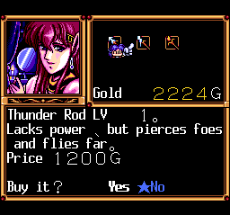

# Fray CD - Xak Gaiden English Translation

## Current status  🏗️

 - Translated most of the text (**needs a revision to fit the available space**)
 - Translated most of the menus
 - Gfx text/buttons are NOT translated
 - **Only partially tested, there may be crashes!**

## Preview  👀

    

## Patch instructions  🩹

1. Setup [this hacked PCECD syscard BIOS](https://github.com/eadmaster/ezrominject/wiki/BIOS-font-hacks) in your emulator/flashcart
2. Obtain a disc dump matching [these hashes](http://redump.org/disc/37536/)
3. Download the latest xdelta patch in this folder
4. Visit [Rom Patcher JS](https://www.marcrobledo.com/RomPatcher.js/)
5. Select `In Magical Adventure - Fray CD - Xak Gaiden (Japan) (Track 02).bin` as ROM file
6. Select `.xdelta` as Patch file
7. Click "Apply patch" and save in the same folder without changing the filename: `"In Magical Adventure - Fray CD - Xak Gaiden (Japan) (Track 02) (patched).bin`
8. Download and use the cue sheet in this folder to play the game
