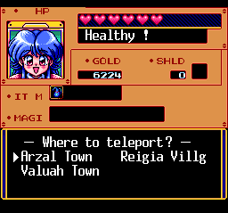

# Fray CD - Xak Gaiden English Translation

## Current status  🏗️

 - All dialogue text translated, 1st revision pass complete.
   - Some lines were shortened to fit in the available space. Check [the original translation here](https://github.com/eadmaster/RetroSubs/wiki/Examples#fray-cd-xak-gaiden-pcecd).
 - Most menus are translated, only a few gfx still left.
 - Only some cutscenes are dubbed, there are no subtitles.
 - First testing playthrough complete.

## Preview  👀

      

## Patch instructions  🩹

1. Setup [this hacked PCECD syscard BIOS](https://github.com/eadmaster/ezrominject/wiki/BIOS-font-hacks) in your emulator/flashcart
2. Visit [Rom Patcher JS](https://www.marcrobledo.com/RomPatcher.js/)
3. Download the [latest xdelta patch in this folder](In%20Magical%20Adventure%20-%20Fray%20CD%20-%20Xak%20Gaiden%20(Japan)%20(Track%2002).bin.xdelta?raw=true), and use it as the Patch file.
   - Note: This is a **rolling release**: check frequently for the latest updates/improvements.
4. Obtain a disc dump matching [these hashes](http://redump.org/disc/37536/).
   Select `In Magical Adventure - Fray CD - Xak Gaiden (Japan) (Track 02).bin` as ROM file.
5. Click "Apply patch" and save in the same folder without changing the filename: `"In Magical Adventure - Fray CD - Xak Gaiden (Japan) (Track 02) (patched).bin"`
6. Download and use the cue sheet in this folder to play the game (Right-click->Save link as...):
   - [Japanese-dubbed version](In%20Magical%20Adventure%20-%20Fray%20CD%20-%20Xak%20Gaiden%20(English).cue?raw=true)
   - [English-dubbed version](In%20Magical%20Adventure%20-%20Fray%20CD%20-%20Xak%20Gaiden%20(English)(dub).cue?raw=true). This also needs [ALL the wave files in this shared folder](https://www.mediafire.com/folder/grzvl6cd2g6rp/In_Magical_Adventure_-_Fray_CD_-_Xak_Gaiden_(English)(dub))

# Credits/Contributors/Special thanks

 - [eadmaster](https://github.com/eadmaster): translation, hacking, playtesting.
 - [Daniel-McLarty](https://github.com/Daniel-McLarty/): [original dubbing pipeline](https://github.com/Daniel-McLarty/Python-Autodub).
