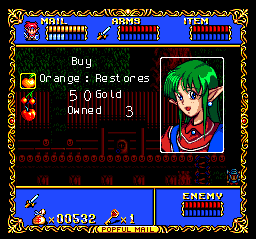

# Popful Mail English Translation

## Current status  🏗️

 - Translated most of the dialogue text (**needs a rewrite/revision to match the dub and to fit the available space**)
 - Menus partially translated
 - **Only partially tested, there may be crashes!**

## Preview  👀

    

## Patch instructions  🩹

1. Setup [this hacked PCECD syscard BIOS](https://github.com/eadmaster/ezrominject/wiki/BIOS-font-hacks) in your emulator/flashcart
2. Obtain a disc dump:
   - matching [these hashes](http://redump.org/disc/68156/) for the Jap dub version
   - [wave/iso/cue dump with this patch applied](https://www.romhacking.net/translations/7517/) for the English dub version.
3. Visit [Rom Patcher JS](https://www.marcrobledo.com/RomPatcher.js/), or use an offline xdelta patcher.
4. Select the corresponding ROM file:
   - `PopfulMail (Japan) (Track 02).bin` (Jap dub)
   - `02 Magical Fantasy Adventure - Popful Mail (J).iso` (Eng dub, crc32=`244c18ed`)
5. Download and select the corresponding `.xdelta` as Patch file:
   - `PopfulMail (Japan) (Track 02).bin.xdelta` (Jap dub)
   - `02 Magical Fantasy Adventure - Popful Mail (J).iso.xdelta` (Eng dub)
6. Click "Apply patch" and save in the same folder without changing the filename (same as the input file with `" (patched)"` appended).
7. Download and use the corresponding cue sheet in this folder to play the game:
   - `PopfulMail (English).cue` (Jap dub)
   - `PopfulMail (English)(dub).cue` (Eng dub)
