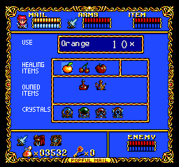

# Popful Mail English Translation

## Current status  🏗️

 - Only the dialogues of the initial areas were revised, still a lot of placeholder text.
 - Most menus are translated, only a few gfx still left.
 - **Only partially tested, there may be crashes!**

## Preview  👀

      

## Patch instructions  🩹

1. Setup [this hacked PCECD syscard BIOS](https://github.com/eadmaster/ezrominject/wiki/BIOS-font-hacks) in your emulator/flashcart
2. Visit [Rom Patcher JS](https://www.marcrobledo.com/RomPatcher.js/), or use an offline xdelta patcher.
3. Obtain a disc dump:
   - matching [these hashes](http://redump.org/disc/68156/) for the Jap dub version
   - [wave/iso/cue dump with this patch applied](https://www.romhacking.net/translations/7517/) for the English dub version.
4. Select the corresponding ROM file:
   - `PopfulMail (Japan) (Track 02).bin` (Jap dub)
   - `02 Magical Fantasy Adventure - Popful Mail (J).iso` (Eng dub, crc32=`244c18ed`)
5. Download and select the corresponding xdelta patch:
   - [`PopfulMail (Japan) (Track 02).bin.xdelta`](PopfulMail%20(Japan)%20(Track%2002).bin.xdelta?raw=true) (Jap dub)
   - [`02 Magical Fantasy Adventure - Popful Mail (J).iso.xdelta`](02%20Magical%20Fantasy%20Adventure%20-%20Popful%20Mail%20(J).iso.xdelta?raw=true) (Eng dub)
      - Note: This is a rolling release: check frequently for the latest updates/improvements.
6. Click "Apply patch" and save in the same folder without changing the filename (same as the input file with `" (patched)"` appended).
7. Download and use the corresponding cue sheet in this folder to play the game (Right-click->Save link as...):
   - [`PopfulMail (English).cue`](PopfulMail%20(English).cue?raw=true) (Jap dub)
   - [`PopfulMail (English)(dub).cue`](PopfulMail%20(English)(dub).cue?raw=true) (Eng dub)

> [!TIP]
> To play the cutscenes correctly in the English-dubbed version without glitches, use the [non-fast beetle libretro core](https://github.com/libretro/beetle-pce-libretro) and set the core option "PC Engine CD->CD Speed" at 8x.

# Credits/Contributors/Special thanks  🤝

In chronological order:

 - [Forrealsyall](https://github.com/Forrealsyall): original script translation
 - [eadmaster](https://github.com/eadmaster): text injection and other patching tools. Script editing and space optimization.
 - [Mentil](https://github.com/mentill): gfx hacking and compression reverse engineering
