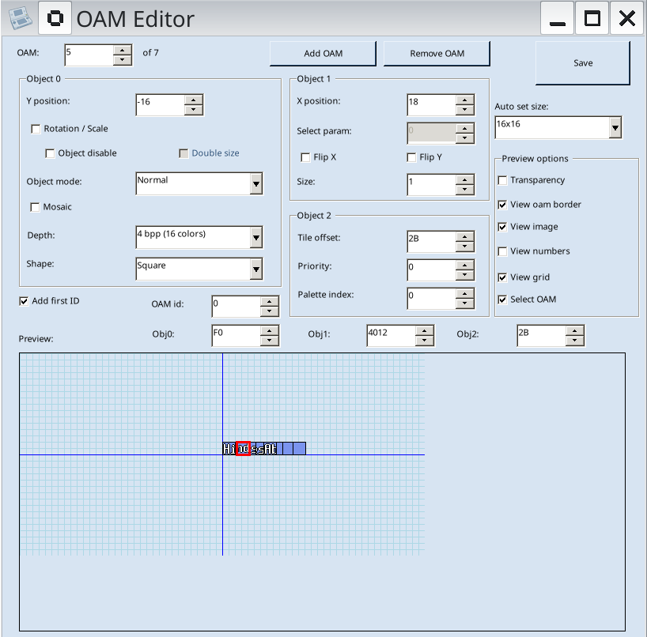

# How to replace graphics in Starfy 4

 

 1. download and start [TinkeDSi](https://github.com/R-YaTian/TinkeDSi)
 2. open `Densetsu no Stafy 4 (Japan).nds` as ROM file
 3. open the `Cell` folder
 4. choose a gfx set to edit, e.g. `title_ue_ob_font.*`
 5. select and click "View" on these files in the correct order:
    1. Palette file `title_ue_ob_font.NCLR`
    2. Tiles file `title_ue_ob_font.NCGR`
    3. Cells file `title_ue_ob_font.NCER`
    - Note: If the files are compressed, click "Unpack" and view the nested file.
 6. scroll the "Bank" drop-down menu to view all the cells
 7. choose a gfx to replace and click the "Export" button. Save it with a png extension and edit it using an external tool like LibreSprite.
    - Note: Don't add new colors into the gfx, reuse the exising ones.
 8. when editing is complete, click the "Import" button to replace the original graphic in the same slot.
 9. click "Save ROM" and test the replacement in an emulator.
 10. if it works correctly, click "Extract" and save the modified tiles file `title_ue_ob_font.NCGR`.
     - Note: If the file was compressed, click "Pack" before "Extract", and answer "No" to keep the compression when exporting.

>[!TIP]
> If there are shared tiles which should not be shared by the replacement gfx too, select "Add image" in "Tile import options".

## OAM Editor

The OAM Editor allows more advanced corrections, use only if necessary.

 

Press the OAM spinner at the top-left to cycle the tiles.
 
For each title, you can:

 - disable/hide the tile with the "Object disable" checkbox
 - change its position with "Obj0" and "Obj1" spinners
 - swap the title with another one in the same set via "Obj2" spinner.

When done, click "Save" and remember to export the updated Cell file
 that stores those infos (e.g. `title_ue_ob_font.NCER`)