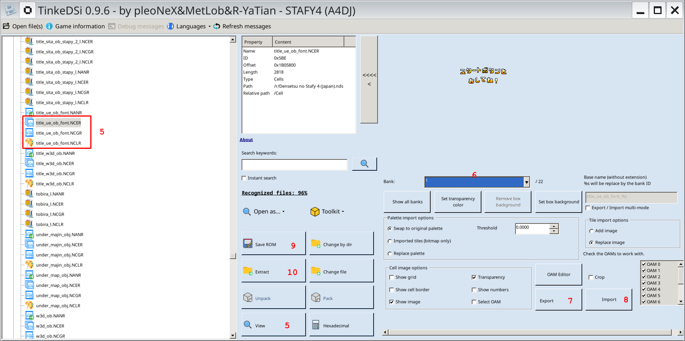

# How to replace graphics in Starfy 4

 

 1. download and start [TinkeDSi](https://github.com/R-YaTian/TinkeDSi)
 2. open `Densetsu no Stafy 4 (Japan).nds` as ROM file
 3. open the `Cell` folder
 4. choose a gfx set to edit, e.g. `title_ue_ob_font.*`
 5. select and click "View" on these files in the correct order:
    1. palette file `title_ue_ob_font.NCLR`
    2. tiles file `title_ue_ob_font.NCGR`
    3. cells file `title_ue_ob_font.NCER`
    - Note: If the files are compressed, click "Unpack" before viewing.
 6. scroll the "Bank" drop-down menu to view all the cells
 7. choose a gfx to replace and click the "Export" button. Save it with a png extension and edit it using an external tool like LibreSprite.
 8. when editing is complete, click the "Import" button to replace the original graphic in the same slot.
 9. click "Save ROM" and test the replacement in an emulator.
 10. if it works correctly, click "Extract" and save the modified tiles file `title_ue_ob_font.NCGR`.
     - Note: If the file was compressed, keep the compression when exporting.

