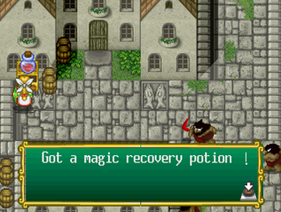

# Valkyrie No Bouken 2 English Translation

## Current status  🏗️

 - Translated most of the menus
 - Translated most of the text (needs a revision)
 - Gfx text/buttons are NOT translated
 - **Only partially tested, there may be crashes!**

## Preview  👀

    

## Patch instructions  🩹

0. Setup the [hacked BIOS](https://github.com/eadmaster/ezrominject/wiki/BIOS-font-hacks) in your emulator/flashcart
1. Obtain a disc dump matching [these hashes](http://redump.org/disc/9757/)
2. Download the latest xdelta patch in this folder
3. Visit [Rom Patcher JS](https://www.marcrobledo.com/RomPatcher.js/)
4. Select `Namco Anthology 2 (Japan).bin` as ROM file
5. Select `.xdelta` as Patch file
6. Click "Apply patch" and save in the same folder without changing the filename: `"Namco Anthology 2 (Japan) (patched).bin`
7. Download and use the cue sheet in this folder to play the game
