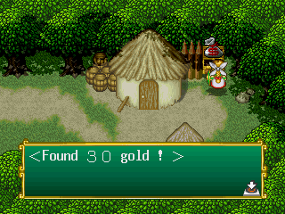
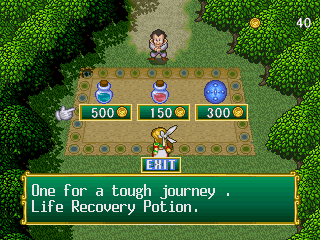
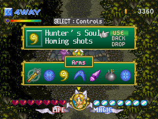

# Valkyrie No Bouken PS1 English Translation

## Current status  🏗️

 - All dialogue text translated, 1st revision pass complete.
 - Only some gfx text/buttons are translated.
 - First testing playthrough complete.

## Preview  👀

      

## Patch instructions  🩹

1. Setup the [hacked BIOS](https://github.com/eadmaster/ezrominject/wiki/BIOS-font-hacks) in your emulator/flashcart
2. Visit [Rom Patcher JS](https://www.marcrobledo.com/RomPatcher.js/), or use an offline xdelta patcher.
3. Obtain a disc dump matching [these hashes](http://redump.org/disc/9757/). Select `Namco Anthology 2 (Japan).bin` as the ROM file.
4. Download the [latest xdelta patch in this folder](https://raw.githubusercontent.com/eadmaster/ezrominject/refs/heads/main/examples/Valkyrie%20No%20Bouken%202%20PS1/Namco%20Anthology%202%20(Japan)%20(patched).bin.xdelta), and use it as the Patch file
5. Click "Apply patch" and save in the same folder without changing the filename: `Namco Anthology 2 (Japan) (patched).bin`
6. Download and use the [cue sheet in this folder](https://raw.githubusercontent.com/eadmaster/ezrominject/refs/heads/main/examples/Valkyrie%20No%20Bouken%202%20PS1/Namco%20Anthology%202%20(English).cue) to play the game (Right-click->Save link as...).

# Credits/Contributors/Special thanks

 - [eadmaster](https://github.com/eadmaster): translation, hacking, playtesting.
 - [Raccoon Sam](https://www.romhacking.net/forum/index.php?action=profile;u=1969): gfx compression reverse engineering.
